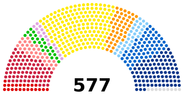

# Parliament Diagram

The Parliament diagram creator is made for use in Wikipedia, supported by Wikimedia Commons and Wikidata.

You can use the tool at http://parliamentdiagram.toolforge.org/archinputform.php

## Dependencies

* Requires the jscolor script, available from [jscolor.com](jscolor.com).
* Requires Python, at least 3.8 is recommended.

## License

This tool is licensed GPL v2, see [LICENSE.md](LICENSE.md).
